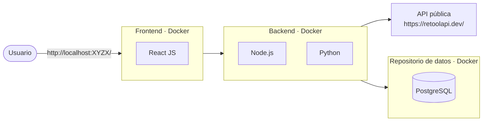
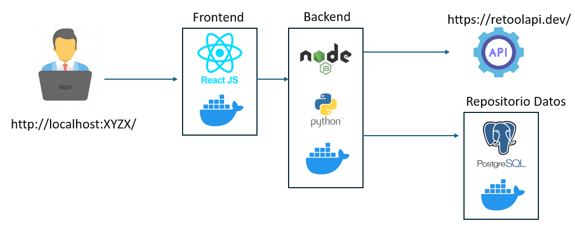
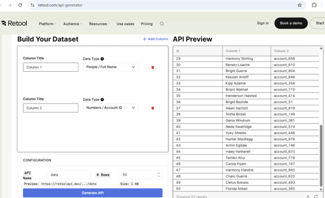
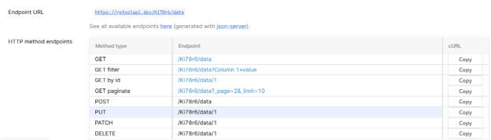

# Reto de Desarrollo FullStack

| | |
|---|---|
| **Nombre del documento** | Reto de Desarrollo Fullstack |
| **Código** | |
| **Fecha de publicación** | 2025 |
| **N.º de edición** | 1.0 |
| **Tipo de documento** | Confidencial |
| **Autor** | Transformación Digital |

*You can only manage what you measure.*

## Control del documento

| | |
|---|---|
| **Autor** | Transformación Digital |
| **Nombre** | Reto de Desarrollo Fullstack |
| **Creado** | 2025 |
| **Última edición** | 2025 |
| **Versión** | 1.0 |

## Índice

- [Introducción](#introducción)
- [1. Alcance](#1-alcance)
- [2. Objetivos del reto](#2-objetivos-del-reto)
- [3. Componentes del reto](#3-componentes-del-reto)
- [4. Requerimientos](#4-requerimientos)
  - [4.1. Base de datos](#41-base-de-datos)
  - [4.2. Backend en Node.js o Python](#42-backend-en-nodejs-o-phyton)
  - [4.3. Integración API pública (Retool.com)](#43-integracion-api-publica-retoolcom)
  - [4.4. Frontend](#44-frontend)
- [5. Tecnologías recomendadas](#5-tecnologias-recomendadas)
- [6. Criterios de evaluación del reto](#6-criterios-de-evaluacion-del-reto)
- [7. Entregable](#7-entregable)

## Introducción

**AJE** actualmente se encuentra en proceso de selección de candidatos para el perfil de desarrollador Fullstack que participara en los futuros proyectos del área y para validar la experiencia del postulante se ha planteado el siguiente reto de desarrollo.

## 1. Alcance

Este desafío de programación consiste en construir una aplicación web completa que implemente las operaciones CRUD (Crear, Leer, Actualizar, Eliminar) para la gestión de registros de clientes, incorporando una integración con una API pública de prueba y actualización de datos en repositorio relacional.

## 2. Objetivos del reto

A continuación, los objetivos del reto:

- Crear una interfaz de usuario (Frontend) moderna y reactiva con SPA.
- Implementar un API REST (Backend) robusto con operaciones CRUD que cumpla con una Arquitectura Limpia y exponga sus APIs con Open API 3.0 y documentado con Swagger.
- El backend debe integrarse con un API publica para completar las operaciones y almacenar los resultados en el repositorio de datos.
- Implementar el Backend usando un ORM para acceder a la base de datos relacional (PostgreSQL).
- Implementar pruebas siguiendo Test-Driven Development.

## 3. Componentes del reto

A continuación, los principales componentes del Reto:

*Figura 1. Diagrama original de los componentes del reto.*

- El frontend (React) realiza solicitudes a los endpoints del backend API REST.
- El backend procesa las solicitudes (crea, lee, actualiza o elimina registros invocando a los métodos del API Publica usando los endpoints de https://retoolapi.dev/
- Luego el backend guarda los datos en una tabla en BD Postgresql.
- El frontend muestra los resultados de cada operación procesada por el backend.
- Los componentes de frontend, backend y base de datos se ejecutan en contenedores Docker.

## 4. Requerimientos

### 4.1. Base de datos

Crear una base de datos en POSTGRESQL llamada `retoDB` y una tabla llamada `cliente` con los siguientes campos (los campos pueden variar según el *payload* de la API externa):

| Campo | Tipo de dato | Restricción | Descripción |
|---|---|---|---|
| id | INTEGER | PRIMARY KEY | Identificador único del cliente. |
| nombres | VARCHAR(255) | NOT NULL | Nombres y apellidos del cliente. |
| email | VARCHAR(255) | UNIQUE, NOT NULL | Correo electrónico. |
| telefono | VARCHAR(50) | NULL | Número de teléfono. |
| fecha_creacion | TIMESTAMP | NOT NULL | Fecha de registro. |
| estado | INTEGER | NOT NULL | Estado del cliente. 1 activo y 0 no activo. |

### 4.2. Backend en Node.js o PHYTON

El backend deberá exponer al frontend un API REST con OPEN API 3.0 con los siguientes métodos:

| Método HTTP | Endpoint | Descripción |
|---|---|---|
| POST | `/api/clientes` | **Crear** un nuevo registro de cliente invocando primero al endpoint del API método POST y luego guarda los datos del cliente en la tabla cliente. Crear un numero random integer para generar el código único del cliente. Retorna el id del cliente creado. |
| GET | `/api/clientes` | **Consultar** y obtener todos los registros de clientes. Consulta los datos de la tabla clientes en la BD Postgresql y retorna todos los datos de los clientes registrados. |
| GET | `/api/clientes/:id` | **Consultar** y obtener un cliente por su id. Busca en la tabla cliente por el id y retorna los datos del cliente. |
| PUT | `/api/clientes/:id` | **Actualizar** un registro de cliente existente. Invocando primero al endpoint del API método PUT y luego guarda los datos del cliente en la tabla cliente. |
| DELETE | `/api/clientes/:id` | **Eliminar** un registro de cliente. Invocando primero al endpoint del API método DELETE y luego elimina lógicamente los datos del cliente de la tabla cliente. |

### 4.3. Integración API pública (RETOOL.COM)

Se debe crear un API de TEST usando el tool online [https://retool.com/api-generator](https://retool.com/api-generator).

En el generador se arma el dataset de prueba: cada columna tiene título y tipo de dato, y en la configuración se define el nombre del recurso, la cantidad de filas y la URL de vista previa. Al generar el API, Retool publica ese recurso en `retoolapi.dev`.

*Figura 2. Dataset de prueba configurado en el generador de Retool.*

Una vez generada la data de prueba y los endpoints generados usarlos para el reto.

El recurso publicado expone los métodos HTTP sobre una URL con un identificador propio. En el ejemplo de la figura, la base es `https://retoolapi.dev/KI78r6/data`: consulta de todos los registros, filtro, consulta por id, paginación, alta, actualización y baja.

*Figura 3. Endpoints HTTP generados para el recurso de prueba.*

El Backend debe realizar una petición por cada operación POST, PUT, DELETE a la API publicada, por ejemplo: `https://retoolapi.dev/YOUR_RESOURCE_ID/clientes`.

### 4.4. Frontend

#### Pantalla de Registro (Create)

- Formulario para ingresar los datos del cliente: Nombre, Email, Teléfono, etc.
- Validación de los campos de entrada.
- Al hacer submit, los datos se enviarán al backend por el método POST.
- Deberá mostrar el listado de clientes actualizado con el nuevo registro.

#### Pantalla de Consulta (Read)

- Mostrar una lista de los clientes registrados.
- Obtendrá los datos del cliente usando el método GET.
- Cada cliente debe tener botones para editar o eliminar su registro.

#### Pantalla de Edición (Update)

- Al hacer clic en un cliente desde la lista de consulta, se abrirá un formulario con los datos del cliente. Usará el método GET por el id del cliente seleccionado.
- Permitirá actualizar los datos y luego enviarlos al backend para que se modifiquen. Usará el método PUT con los datos del cliente.
- Deberá mostrar el listado de clientes actualizado con el registro modificado.

#### Pantalla de Eliminación (Delete)

- Permitir eliminar un cliente seleccionado en la lista.
- Al hacer click en el botón o link eliminar, se debe hacer una solicitud al backend para eliminar el cliente de la base de datos. Usará el método DELETE del backend.
- Deberá mostrar el listado de clientes actualizado sin el registro.

## 5. Tecnologías recomendadas

A continuación, el stack tecnológico base:

**Frontend:**

- React (v18 o superior)
- React Router
- Fetch API
- Bootstrap o Material UI (opcional para estilos)

**Backend:**

- Node.js con Express o Python con Flask/FastAPI
- Axios o Requests para consumir la API externa
- Pycircuitbreaker o CircuitBreaker para NodeJS
- Se recomienda usar un ORM como Sequelize para Node.js o SQLAlchemy para Python.

**Base de datos:**

- PostgreSQL 17.x o superior

**Entorno:**

- Docker 22.x o superior

**Calidad de código:**

- Usar plugin sonarqube para IDE de desarrrollo

## 6. Criterios de evaluación del reto

A continuación, los criterios de evaluación del Reto:

1. Estructura del proyecto de frontend y backend usando Clean Architecture.
2. Ejecución exitosa de todas las pruebas unitarias considerando flujo de excepciones.
3. Implementar validación de formularios en el Frontend y mensajes de confirmación de éxito o fallo.
4. Implementar validación de datos de entrada en los métodos del Backend. Uso correcto de los códigos de respuesta HTTP.
5. Documentación de API de backend con Swagger y OPEN API 3.0
6. Implementación de Patrón Circuit Breaker para la integración con el API publica de prueba.
7. Cumplimiento de métricas de calidad de código usando scanner de tool Sonarqube.
8. Uso de Docker y docker-compose para el despliegue local de la aplicación (Frontend, Backend y PostgreSQL).
9. Elaboración de archivo README con el procedimiento de instalación y ejecución.

## 7. Entregable

El código deberá entregarse en un archivo zip conteniendo el nombre del participante y su apellido.
